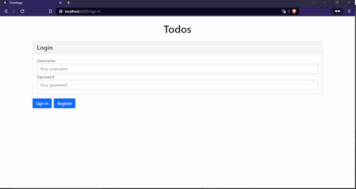

<h1 align="center">Todo list app</h1>
 
<p align="center">A simple appication that allows you to list your todos and manage them.</p>
 
 
## 🛠  Technologies
 
Here are the technologies used to develop this project.
 
* [Angular](https://angular.io/)
* [Node.js](https://nodejs.org/en/)
* [Bootstrap](https://getbootstrap.com/)
* [Typescript](https://www.typescriptlang.org/)
* [HTML 5](https://developer.mozilla.org/en-US/docs/Glossary/HTML5)
* [Git](https://git-scm.com/)
* [Karma framework](https://karma-runner.github.io/6.3/index.html)
 
## Demonstration
<p align="center"></p>


## 📲 Features

- [x] User register
- [x] User login
- [x] Creation of todos
- [x] Removal of todos
- [x] Maintain users registered after reload the page

## Contents learned
* How to initialize a new Angular application using Angular CLI
* How to implement business logic in an Angular service and how to test our business logic with unit tests
* How to use a component to interact with the user and how to delegate logic to a service using dependency injection
* The basics of Angular template syntax
* How to pass data into a component using property bindings
* How to listen for events emitted by a component using event listeners
* How to create smart and dumb components and why dumb components are a good practice
* How to use the Angular HttpClient to perform HTTP requests
* How to deal with Observables that are returned by the Angular HttpClient
* How to create a mock REST API back end
* How to set up Angular Router and configure routes for our application
* How to handle unknown URLs
* How to use a resolver to let Angular Router resolve data
* How to create a sign-in and register form using an Angular reactive form
* How to create a route guard to prevent unauthorized access to parts of your application
* How to send a user’s token as an Authorization Header in an HTTP request to your API

## Pre-requisites
1. Install latest NodeJS version into your machine from https://nodejs.org/en/download/.
2. Install Angular CLI with `npm install -g @angular/cli`.

## Getting started
```bash
# Clone the Git Repo into your Local Machine
$ git clone https://github.com/MatheusPaixaoG/ToDo-app.git
```

### Server
```bash
# Install Dependencies
$ cd ToDo-app
$ cd todoapp-server
$ npm install

# Run the Application
$ npm start

# The server will be running on http://localhost:3000
```

### GUI
```bash
# Install Dependencies
$ cd ToDo-app
$ cd todo-app
$ npm install

# Run the Application
$ npm start

# Access http://localhost:4200 on your browser
```
 
## Links
 
  - Based on the project: https://github.com/sitepoint-editors/angular-todo-app 

 
## Authors
 
 **Made with ❤ by Matheus Paixão**
